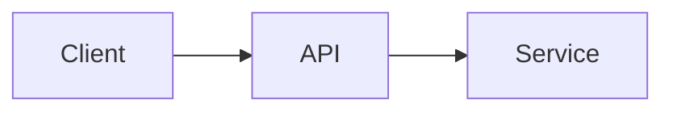

# Mermaid Standards

This page defines Mermaid standards for the Enterprise AI Platform documentation.

## Purpose

- Keep diagrams consistent and maintainable.
- Use Mermaid for architecture and workflow visuals.
- Keep diagrams simple and easy to update.

## General Rules

- Use `graph`, `flowchart`, `sequenceDiagram`, or `classDiagram` as appropriate.
- Keep each diagram focused on a single concept.
- Use descriptive node labels and avoid overloaded visuals.
- Use comments sparingly for readability.

## Syntax

- Wrap Mermaid code in fenced blocks with `mermaid`.
- Use consistent spacing and indentation.

## Example

```markdown

```

## Best Practices

- Prefer flowcharts for architecture diagrams.
- Use sequence diagrams for request and authentication flows.
- Use labels to clarify participant roles.
- Keep complex diagrams split into smaller diagrams.
