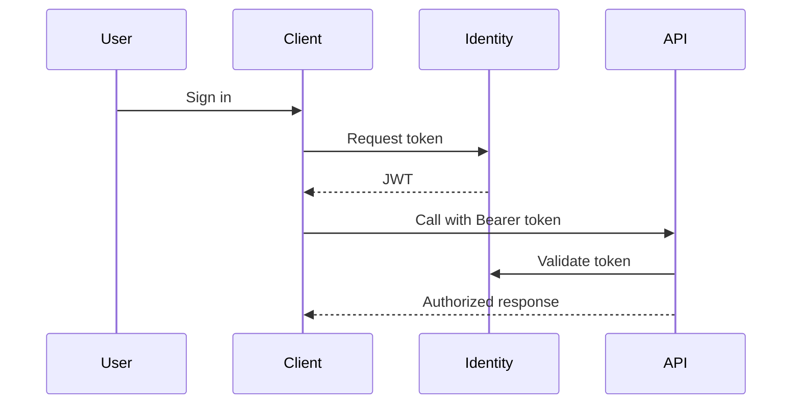

# Authentication Flow

```mermaid
sequenceDiagram
    participant User
    participant Client
    participant Identity
    participant API

    User->>Client: Sign in
    Client->>Identity: Request token
    Identity-->>Client: JWT
    Client->>API: Call with Bearer token
    API->>Identity: Validate token
    API-->>Client: Authorized response
```

