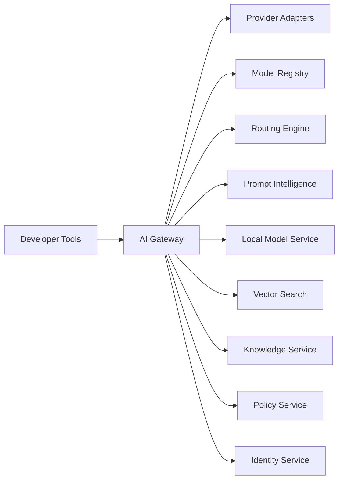

# High-Level Architecture

```mermaid
flowchart LR
    IDE[Developer Tools] --> GW[AI Gateway]
    GW --> PA[Provider Adapters]
    GW --> MR[Model Registry]
    GW --> RT[Routing Engine]
    GW --> PI[Prompt Intelligence]
    GW --> LM[Local Model Service]
    GW --> VS[Vector Search]
    GW --> K[Knowledge Service]
    GW --> PL[Policy Service]
    GW --> ID[Identity Service]
```

