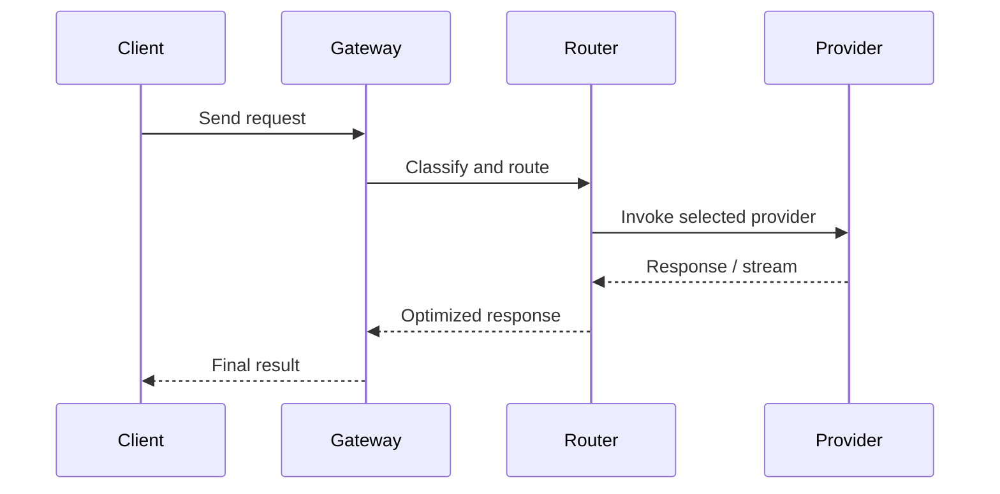

# Request Flow

```mermaid
sequenceDiagram
    participant Client
    participant Gateway
    participant Router
    participant Provider

    Client->>Gateway: Send request
    Gateway->>Router: Classify and route
    Router->>Provider: Invoke selected provider
    Provider-->>Router: Response / stream
    Router-->>Gateway: Optimized response
    Gateway-->>Client: Final result
```

