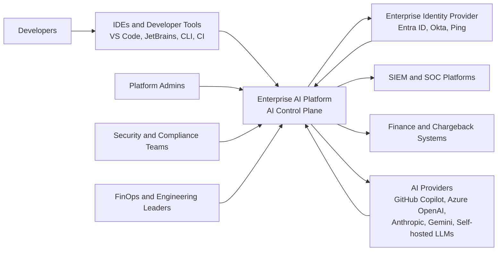
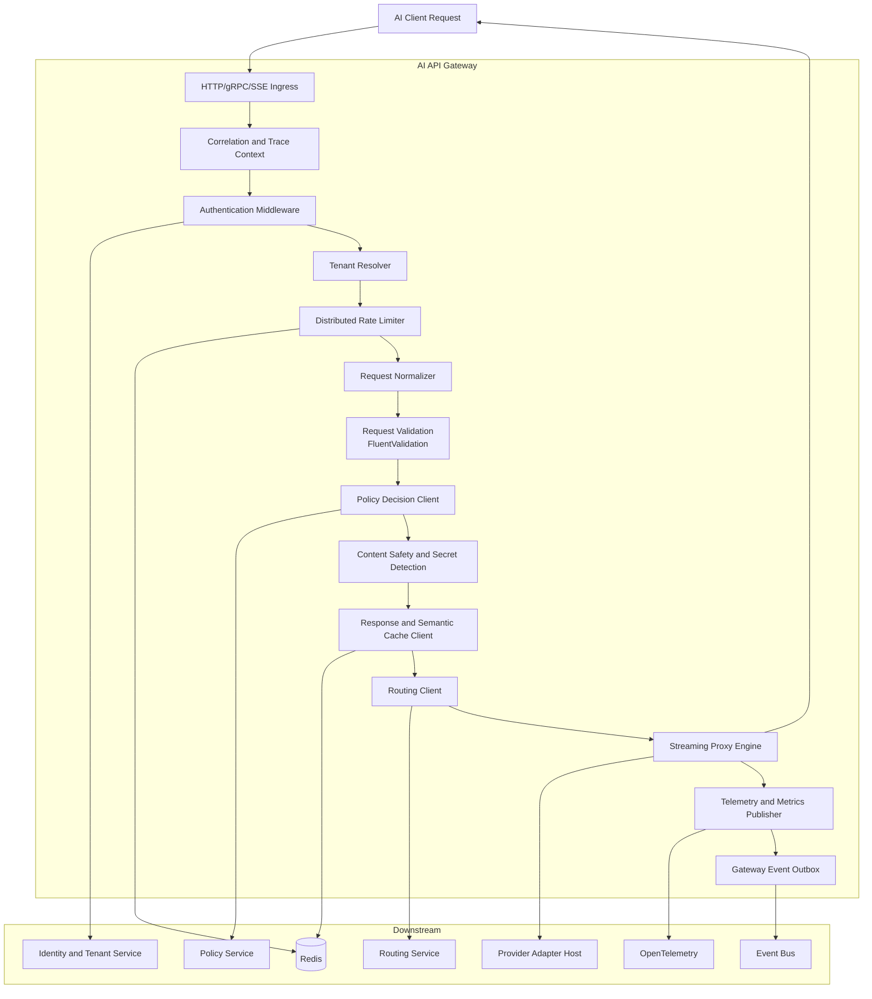
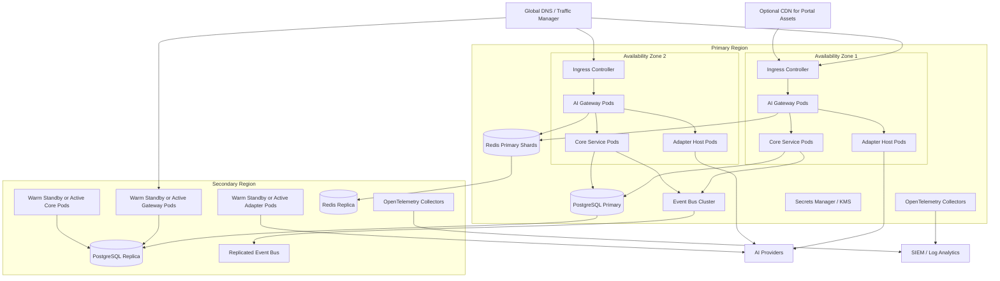
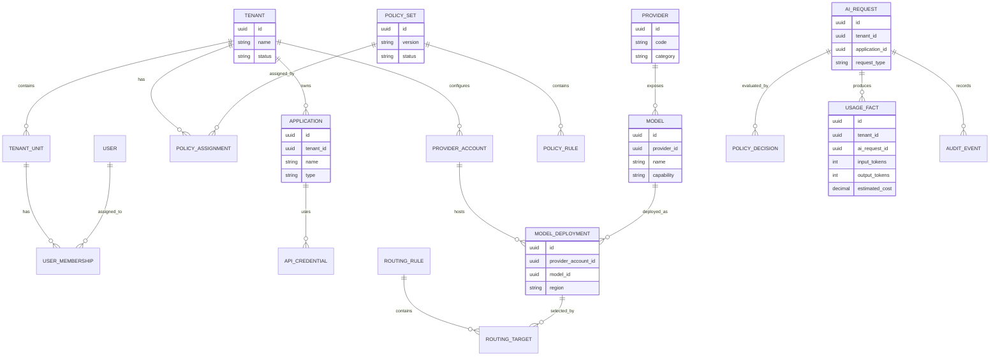
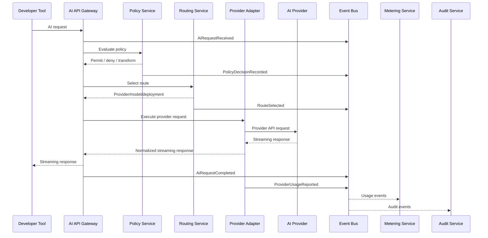
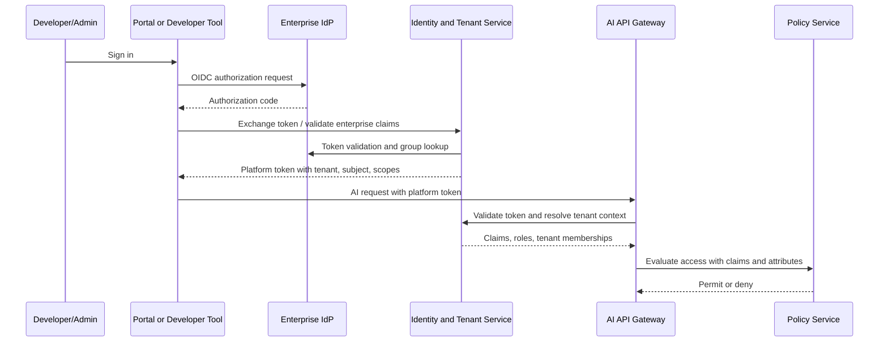
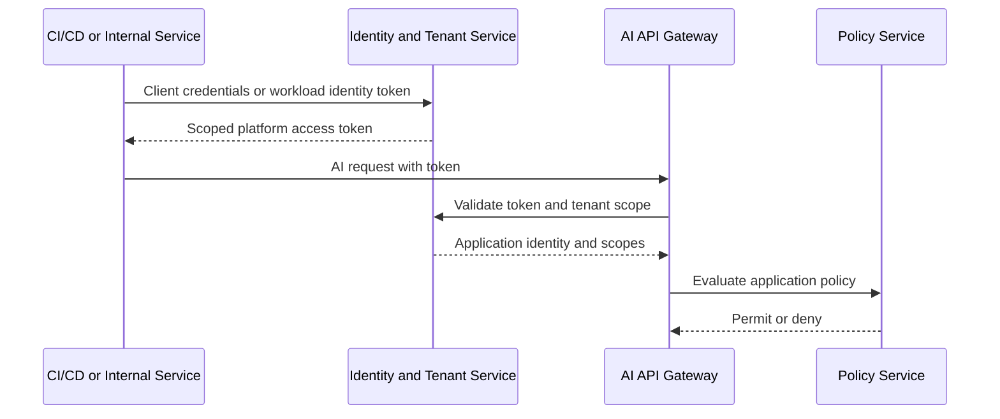
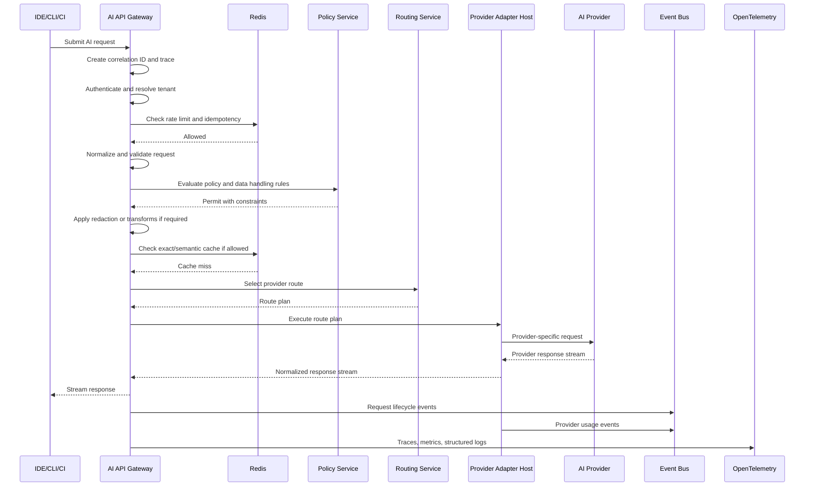

# Enterprise AI Platform Architecture

Status: Draft for enterprise architecture review  
Date: 2026-06-30  
Scope: Complete target architecture only. No implementation code.

## 1. Executive Summary

The Enterprise AI Platform is an AI control plane for software development organizations. It sits between developer-facing tools and AI providers to centralize governance, routing, security, observability, cost controls, provider abstraction, and developer experience.

The platform is not intended to replace GitHub Copilot. GitHub Copilot is treated as one supported provider/integration alongside Azure OpenAI, Anthropic, Gemini, self-hosted models, and future providers. The platform provides a governed gateway, policy layer, provider adapter layer, and observability plane for enterprise AI usage.

The architecture follows Clean Architecture, Domain Driven Design, SOLID principles, event-driven design where useful, and cloud-native deployment on Kubernetes. The preferred implementation stack is .NET 9, ASP.NET Core, PostgreSQL, Redis, Docker, Kubernetes, OpenTelemetry, Serilog, MediatR, FluentValidation, Entity Framework Core, and YARP where useful.

## 2. Goals

- Provide a centralized AI gateway and control plane for developer AI usage.
- Reduce AI spend through routing, caching, quotas, budgets, model selection, and usage analytics.
- Improve governance through tenant-aware policy enforcement, auditability, model allowlists, provider controls, and data handling rules.
- Improve security through identity integration, least-privilege access, encrypted secrets, prompt/content controls, tenant isolation, and full audit trails.
- Improve observability through end-to-end tracing, request metrics, token metrics, cost metrics, provider health, and policy decision visibility.
- Support multiple providers without coupling domain logic to provider-specific APIs.
- Support high availability, horizontal scalability, cloud-native operations, and multi-region deployment.

## 3. Non-Goals

- Replacing GitHub Copilot as an IDE coding assistant.
- Building proprietary foundation models as part of the control plane.
- Forcing all providers into a lowest-common-denominator API.
- Storing source code or prompts by default without explicit tenant policy.
- Implementing a marketplace, agent framework, or autonomous development system in the initial platform architecture.

## 4. Architecture Principles

- Control plane first: centralize policy, routing, observability, and cost governance.
- Provider-neutral core: all provider-specific details stay behind adapter boundaries.
- Tenant isolation by design: identity, data, caches, secrets, events, logs, and metrics are tenant-scoped.
- Clean Architecture: domain models and use cases do not depend on infrastructure.
- DDD bounded contexts: services own their domain language and persistence.
- Event-driven where it creates resilience or decoupling, not for every synchronous interaction.
- Secure by default: deny-by-default policies, least privilege, encrypted data, secret isolation, and auditable decisions.
- Cloud-native operations: stateless services, Kubernetes-native deployment, health checks, autoscaling, and OpenTelemetry.
- Streaming-aware: the AI gateway must support low-latency token streaming while still enforcing policy and collecting telemetry.

## 5. System Context Diagram



## 6. Container Diagram

```mermaid
flowchart TB
    subgraph Clients
        IDE[Developer Tools and IDE Extensions]
        CLI[CLI and CI/CD Integrations]
        Portal[Admin and Developer Portal]
    end

    subgraph Edge
        WAF[WAF / Ingress Controller]
        APIGW[AI API Gateway<br/>ASP.NET Core + YARP]
    end

    subgraph Core["Core Platform Services"]
        AuthSvc[Identity and Tenant Service]
        PolicySvc[Policy and Governance Service]
        RoutingSvc[Routing and Optimization Service]
        ModelSvc[Provider and Model Registry Service]
        MeteringSvc[Metering and Cost Service]
        AuditSvc[Audit and Compliance Service]
        ObsSvc[Observability Control Service]
        PortalBff[Portal BFF]
    end

    subgraph ProviderLayer["Provider Adapter Layer"]
        AdapterHost[Provider Adapter Host]
        CopilotAdapter[GitHub Copilot Integration Adapter]
        AzureAdapter[Azure OpenAI Adapter]
        AnthropicAdapter[Anthropic Adapter]
        GeminiAdapter[Gemini Adapter]
        SelfHostedAdapter[Self-hosted LLM Adapter]
    end

    subgraph DataPlane["Data and Messaging"]
        Postgres[(PostgreSQL Cluster)]
        Redis[(Redis Cluster)]
        Bus[Event Bus]
        ObjectStore[(Encrypted Object Storage<br/>Optional prompt/response retention)]
        Vault[Secrets Manager / KMS]
        OTel[OpenTelemetry Collector]
    end

    subgraph External
        IdP[Enterprise IdP]
        Providers[External and Self-hosted AI Providers]
        SIEM[SIEM]
        Billing[Billing / Chargeback]
    end

    IDE --> WAF
    CLI --> WAF
    Portal --> WAF
    WAF --> APIGW

    APIGW --> AuthSvc
    APIGW --> PolicySvc
    APIGW --> RoutingSvc
    APIGW --> AdapterHost
    APIGW --> Redis
    APIGW --> Bus
    APIGW --> OTel

    PortalBff --> AuthSvc
    PortalBff --> PolicySvc
    PortalBff --> ModelSvc
    PortalBff --> MeteringSvc
    PortalBff --> AuditSvc

    RoutingSvc --> ModelSvc
    RoutingSvc --> Redis
    PolicySvc --> Postgres
    ModelSvc --> Postgres
    AuthSvc --> Postgres
    MeteringSvc --> Postgres
    AuditSvc --> Postgres
    AuditSvc --> ObjectStore
    MeteringSvc --> Billing

    AdapterHost --> CopilotAdapter
    AdapterHost --> AzureAdapter
    AdapterHost --> AnthropicAdapter
    AdapterHost --> GeminiAdapter
    AdapterHost --> SelfHostedAdapter
    AdapterHost --> Providers
    AdapterHost --> Vault

    Bus --> MeteringSvc
    Bus --> AuditSvc
    Bus --> ObsSvc
    OTel --> SIEM
    AuthSvc --> IdP
```



## 7. Component Diagram: AI API Gateway



## 8. Deployment Diagram



## 9. Service Boundaries

| Bounded Context / Service | Primary Responsibility | Owns Data | Does Not Own |
| --- | --- | --- | --- |
| AI API Gateway | Request ingress, protocol handling, streaming, auth enforcement, tenant resolution, rate limiting, request normalization, gateway telemetry | Short-lived gateway request state, idempotency keys, cache references | Long-term policy, billing, provider credentials |
| Identity and Tenant Service | Tenant hierarchy, tenant membership, enterprise IdP integration, service principals, API credentials, tenant lifecycle | Tenants, users, groups, memberships, applications, credentials metadata | Enterprise IdP source of truth, provider credentials values |
| Policy and Governance Service | Policy authoring, policy evaluation, model access, data handling rules, quota and budget policy, approval workflows | Policy sets, assignments, policy decisions, governance configuration | Usage facts, provider execution |
| Routing and Optimization Service | Provider/model selection, weighted routing, failover, cost-aware routing, latency-aware routing, circuit-breaker state | Routing rules, route health snapshots, provider scorecards | Provider credential values, policy authoring |
| Provider and Model Registry Service | Catalog of providers, model capabilities, deployments, pricing metadata, data residency, feature flags | Provider definitions, model catalog, deployment metadata, pricing references | Provider call execution |
| Provider Adapter Host | Provider-specific request transformation, authentication to providers, streaming translation, provider error normalization | Adapter runtime state, provider connection health | Tenant policy, metering aggregation |
| Metering and Cost Service | Token usage, request counts, cost estimation, budget consumption, chargeback exports | Usage facts, cost facts, budget snapshots, invoices/exports | Policy decisions, raw provider secrets |
| Audit and Compliance Service | Immutable audit trail, compliance exports, evidence, retention policy execution | Audit events, retention records, compliance exports | Real-time request routing |
| Observability Control Service | Platform dashboards, SLO definitions, alert routing metadata, telemetry taxonomy | SLO config, alert metadata, dashboard definitions | Raw observability backend storage |
| Portal BFF | Aggregated APIs for admin/developer portal, UI-specific composition | No domain data except UI session references | Business rules and persistence |
| Background Worker Services | Outbox publishing, event consumers, retention jobs, reconciliation, provider health probes | Job leases and execution checkpoints | Interactive request serving |

## 10. Microservices

### 10.1 AI API Gateway

The AI API Gateway is the synchronous data-plane entry point. It exposes enterprise-approved AI APIs to developer tools, internal services, CLIs, and CI/CD pipelines.

Key responsibilities:

- Authenticate callers and enforce tenant scoping.
- Normalize incoming AI requests into canonical internal commands.
- Support streaming responses using SSE, HTTP streaming, or provider-compatible streaming.
- Enforce rate limits, quotas, and request validation.
- Call the Policy Service before provider execution.
- Call the Routing Service to select provider/model/deployment.
- Forward requests to the Provider Adapter Host.
- Publish request lifecycle events.
- Emit OpenTelemetry traces, metrics, and logs.

The gateway remains stateless except for distributed cache, rate-limit counters, idempotency state, and correlation metadata.

### 10.2 Identity and Tenant Service

Manages platform tenancy and identity integration. Enterprise user identity remains in the enterprise IdP.

Key responsibilities:

- OIDC/SAML federation with Entra ID, Okta, Ping, or other enterprise IdPs.
- Tenant, organization, workspace, team, and project hierarchy.
- API clients, service principals, scoped developer tokens, and machine identities.
- RBAC role assignments and ABAC attributes used by policy.
- Tenant-aware credential metadata and key references.

### 10.3 Policy and Governance Service

Acts as the central policy decision point.

Policy examples:

- Which providers and models a tenant/team/project can use.
- Whether source code content may be sent to an external provider.
- Whether prompts/responses can be stored.
- Max tokens per request, per user, per project, or per provider.
- Budget thresholds and approval requirements.
- Data classification rules and redaction rules.
- Required provider region or self-hosted-only restrictions.

The gateway and adapter host act as policy enforcement points.

### 10.4 Routing and Optimization Service

Selects the best route for an AI request after policy approval.

Routing inputs:

- Tenant policy constraints.
- Requested capability such as chat, code completion, embeddings, tool calling, or reasoning.
- Provider/model health.
- Latency, token price, context length, region, data residency, and quota state.
- Routing rules such as canary, weighted routing, fallback chains, and cost optimization.

Routing outputs:

- Provider adapter.
- Provider deployment.
- Model identifier.
- Credential reference.
- Timeout, retry, fallback, and streaming strategy.

### 10.5 Provider and Model Registry Service

Maintains a governed catalog of provider integrations and model capabilities.

Examples:

- GitHub Copilot integration metadata.
- Azure OpenAI deployments and regions.
- Anthropic model families and capabilities.
- Gemini model families and capabilities.
- Self-hosted model endpoints.
- Cost metadata, context windows, supported modalities, data-retention constraints, and feature flags.

### 10.6 Provider Adapter Host

Executes provider-specific calls behind a stable internal contract.

Adapter responsibilities:

- Transform canonical internal requests into provider-specific APIs.
- Sign requests using tenant/provider credential references from the secrets manager.
- Translate provider responses and errors into normalized response envelopes.
- Preserve streaming semantics.
- Emit provider-specific telemetry without leaking sensitive prompt content.
- Implement provider-specific retries, circuit breaking, and timeout handling.

Adapters must be independently versioned and capability-declared. New providers are added through new adapters and model registry entries, not by changing gateway domain logic.

### 10.7 Metering and Cost Service

Consumes request lifecycle events and provider usage events to build cost and usage facts.

Key responsibilities:

- Token accounting by tenant, project, user, model, provider, and application.
- Cost estimation using pricing metadata and provider invoices where available.
- Budget consumption and alerting.
- Chargeback/showback exports.
- Usage anomaly detection inputs.
- Reconciliation with provider-side usage records.

### 10.8 Audit and Compliance Service

Maintains immutable audit records for security and compliance review.

Audit events include:

- Authentication and token issuance.
- Policy decisions.
- Provider route selections.
- Administrative changes.
- Secret reference changes.
- Request metadata, excluding prompt/response content unless tenant policy explicitly allows retention.
- Data retention and export actions.

### 10.9 Observability Control Service

Provides observability governance and platform-level operational insights.

Responsibilities:

- Defines standard telemetry dimensions and semantic conventions.
- Manages SLOs, dashboards, and alert policies.
- Tracks provider health, route health, and platform health.
- Provides operations-facing views for latency, errors, saturation, cost, and policy outcomes.

## 11. Database Architecture

### 11.1 Persistence Principles

- Each service owns its data and exposes APIs/events for cross-service access.
- PostgreSQL is the system of record for transactional data.
- Redis is used for low-latency ephemeral state: rate limits, idempotency, cache entries, route health snapshots, and short-lived token/session state.
- Event publishing uses the transactional outbox pattern to avoid dual-write inconsistencies.
- Prompt and response content are not stored by default. If enabled by tenant policy, content is encrypted and stored separately with strict retention controls.
- Tenant isolation is enforced in application code, database constraints, PostgreSQL Row-Level Security where appropriate, encryption boundaries, cache key design, and telemetry tags.

### 11.2 Logical Data Stores

| Store | Technology | Owner | Purpose |
| --- | --- | --- | --- |
| Tenant Store | PostgreSQL | Identity and Tenant Service | Tenant hierarchy, memberships, applications, API credentials metadata |
| Policy Store | PostgreSQL | Policy and Governance Service | Policy definitions, assignments, decision records |
| Model Registry Store | PostgreSQL | Provider and Model Registry Service | Providers, models, capabilities, deployments, pricing metadata |
| Routing Store | PostgreSQL + Redis | Routing and Optimization Service | Routing rules, route health, circuit breaker snapshots |
| Metering Store | PostgreSQL partitioned tables | Metering and Cost Service | Usage facts, token counts, estimated costs, budget snapshots |
| Audit Store | PostgreSQL append-only tables + object storage | Audit and Compliance Service | Immutable audit records and compliance exports |
| Gateway Cache | Redis Cluster | AI API Gateway | Rate limits, idempotency keys, response cache metadata |
| Semantic Cache | Redis + PostgreSQL pgvector or approved vector store | AI API Gateway / Routing | Tenant-scoped exact and semantic cache, enabled only by policy |
| Secrets Store | Cloud KMS / Key Vault / Vault | Platform Security | Provider credentials, signing keys, encryption keys |
| Telemetry Store | Observability backend | Platform Operations | Logs, metrics, traces, dashboards, alerts |

### 11.3 Core Entity Relationships



### 11.4 Multi-Tenant Database Strategy

Recommended default: shared PostgreSQL clusters with tenant-scoped schemas/tables, mandatory `tenant_id`, table partitioning for high-volume facts, Row-Level Security on tenant-sensitive tables, and per-tenant encryption context.

Enterprise isolation options:

- Standard tenants: shared database, shared schema, tenant-scoped rows.
- Regulated tenants: dedicated schema or dedicated database.
- Highly regulated tenants: dedicated cluster and dedicated encryption keys.

The application architecture must support all three without changing domain logic.

### 11.5 High-Volume Tables

The highest-volume tables are expected to be:

- `ai_request_metadata`
- `usage_facts`
- `audit_events`
- `policy_decisions`
- `provider_health_samples`
- `gateway_rate_limit_events`

These should use:

- Time-based partitioning.
- Tenant and timestamp composite indexes.
- Cold storage export for long retention.
- Append-only write patterns where feasible.
- Read replicas for analytics queries.

## 12. Event Flow

### 12.1 Event-Driven Architecture

The platform uses events for decoupled post-request processing, audit, metering, analytics, provider health, and notifications. The synchronous request path remains lean and avoids blocking on non-critical downstream work.

Recommended event infrastructure:

- Kafka, Redpanda, Azure Event Hubs, or equivalent managed event bus.
- Transactional outbox in each service that writes business state and outbound events.
- Inbox/idempotency table in consumers.
- Dead-letter topics and replay tooling.
- Schema registry and versioned event contracts.

### 12.2 Main AI Request Event Sequence



### 12.3 Core Event Types

| Event | Producer | Consumers | Purpose |
| --- | --- | --- | --- |
| `TenantCreated` | Identity and Tenant Service | Policy, Model Registry, Audit | Initialize tenant defaults |
| `PolicySetPublished` | Policy Service | Gateway, Routing, Audit | Invalidate policy caches and record governance change |
| `AiRequestReceived` | Gateway | Audit, Observability | Record request start metadata |
| `PolicyDecisionRecorded` | Policy Service | Audit, Metering, Observability | Explain allow/deny/transform decisions |
| `RouteSelected` | Routing Service | Audit, Metering, Observability | Record selected provider/model and routing reason |
| `ProviderRequestStarted` | Adapter Host | Observability | Track provider latency and saturation |
| `ProviderUsageReported` | Adapter Host | Metering, Audit | Persist token usage and cost inputs |
| `AiRequestCompleted` | Gateway | Metering, Audit, Observability | Record completion status and timing |
| `ProviderHealthChanged` | Adapter Host / Worker | Routing, Observability | Trigger route score and circuit breaker updates |
| `BudgetThresholdReached` | Metering | Policy, Notifications, Audit | Enforce budget controls and notify owners |
| `AuditExportRequested` | Audit Service | Background Workers | Generate compliance export |

## 13. Authentication Flow

### 13.1 Human User Flow



### 13.2 Machine-to-Machine Flow



### 13.3 Token and Authorization Requirements

- Use OIDC for human users and workload identity/client credentials for machines.
- Platform tokens must include tenant ID, subject, application ID where applicable, scopes, roles, and correlation claims.
- Authorization combines RBAC and ABAC.
- Administrative APIs require stronger scopes and optional step-up authentication.
- Long-lived static API keys should be avoided. If required for tool compatibility, store only hashed token material and bind tokens to tenant, application, scopes, network constraints, and expiry.
- Service-to-service traffic should use mTLS through a service mesh or equivalent workload identity.

## 14. AI Request Flow



### 14.1 Request Decision Points

1. Authentication: Is the caller known and token valid?
2. Tenant resolution: Which tenant, application, project, and policy scope apply?
3. Rate limit: Is the caller within tenant, user, application, and provider limits?
4. Request validation: Is the request structurally valid and within max limits?
5. Data classification: Does the request include sensitive content, secrets, or restricted code?
6. Policy evaluation: Is the requested action, model, provider, and data handling mode allowed?
7. Cache eligibility: Can the request use exact or semantic cache under tenant policy?
8. Routing: Which provider/model/deployment best satisfies policy, cost, latency, and availability?
9. Provider execution: Can the provider fulfill the request within timeout and quota?
10. Post-processing: What metadata, audit records, and usage facts must be emitted?

## 15. Observability

### 15.1 Telemetry Standards

The platform uses OpenTelemetry for traces, metrics, and logs correlation. Serilog provides structured application logging with trace and tenant correlation.

Every request must include:

- `trace_id`
- `correlation_id`
- `tenant_id`
- `application_id`
- `user_id` or service principal ID when available
- `request_type`
- `provider`
- `model`
- `route_id`
- `policy_decision_id`
- `cache_status`
- `status_code`
- `error_category`

Prompt and response content must not be logged by default.

### 15.2 Metrics

Core platform metrics:

- Request rate by tenant, provider, model, endpoint, and application.
- Request latency: gateway, policy, routing, adapter, provider, total.
- Streaming time to first token.
- Streaming total duration.
- Input tokens, output tokens, cached tokens.
- Estimated cost by tenant, project, provider, and model.
- Policy allow/deny/transform counts.
- Rate-limit and quota rejections.
- Cache hit ratio.
- Provider error rate and timeout rate.
- Circuit breaker state.
- Event bus lag, dead-letter count, consumer failure count.
- PostgreSQL latency, connection pool saturation, replication lag.
- Redis latency, memory, evictions, cluster health.

### 15.3 Logs

Structured logs should include:

- Security-relevant events.
- Administrative changes.
- Policy evaluation references, not sensitive content.
- Provider route decisions.
- Error normalization details.
- Dependency health changes.

Logs must be redacted, tenant-tagged, and retained according to compliance policy.

### 15.4 Traces

Representative spans:

- Gateway request received.
- Token validation.
- Tenant resolution.
- Rate-limit check.
- Policy evaluation.
- Safety scanning/redaction.
- Cache lookup.
- Routing decision.
- Provider adapter execution.
- Provider stream first token.
- Event outbox write.
- Response completed.

### 15.5 SLOs

Initial target SLOs for architecture review:

- Gateway availability: 99.95% monthly for production tenants.
- Admin portal availability: 99.9% monthly.
- Gateway added latency excluding provider time: p95 under 100 ms for non-stream setup paths.
- Policy evaluation latency: p95 under 30 ms with warm cache.
- Event publication freshness: p95 under 60 seconds from request completion.
- Audit record durability: no acknowledged administrative action without durable audit event.

## 16. Security Architecture

### 16.1 Security Controls

- OIDC/SAML federation with enterprise IdP.
- RBAC for administration and ABAC for runtime policy decisions.
- Deny-by-default provider/model access.
- Tenant-aware authorization on every request.
- mTLS for service-to-service communication.
- Network policies between namespaces and services.
- Secrets stored in KMS/Key Vault/Vault, never in application configuration.
- Provider credentials scoped per tenant/provider/environment.
- Encryption in transit and at rest.
- Optional tenant-managed keys for regulated tenants.
- Prompt/response logging disabled by default.
- Data redaction and secret detection before external provider calls.
- WAF and API rate limiting at edge and gateway.
- Signed administrative audit records.
- Immutable audit storage with retention controls.
- Container image scanning and SBOM generation.
- Admission policies for Kubernetes deployments.
- Least-privilege database credentials per service.
- Row-Level Security where shared tables contain tenant-sensitive data.
- Break-glass access with strong audit and time-bound elevation.

### 16.2 Threat Areas and Mitigations

| Threat | Mitigation |
| --- | --- |
| Cross-tenant data leakage | Tenant-scoped identity, RLS, cache key scoping, tenant-specific encryption context, automated tests |
| Provider credential exposure | Secrets manager, short-lived credentials where possible, no plaintext logging, least privilege |
| Prompt or source leakage | Policy controls, redaction, external-provider restrictions, retention disabled by default |
| Cost abuse | Quotas, budgets, rate limits, anomaly alerts, approval workflows |
| Prompt injection against platform controls | Treat prompts as untrusted content, do not let model output alter policy, route, or authorization decisions |
| Provider outage | Health probes, circuit breakers, fallback routes, tenant-defined failover policy |
| Replay attacks | Token expiry, nonce/idempotency keys, TLS, request signing for selected clients |
| Supply-chain compromise | Signed images, SBOM, dependency scanning, restricted base images, Kubernetes admission control |
| Privilege escalation | RBAC/ABAC, separation of duties, audited admin actions, step-up auth |

### 16.3 Data Classification

The platform should support tenant-defined data classes:

- Public.
- Internal.
- Confidential.
- Regulated.
- Secret-bearing.

Policy may map data class to allowed providers, regions, retention modes, redaction requirements, and approval requirements.

## 17. Scaling Strategy

### 17.1 Horizontal Scaling

- AI API Gateway scales horizontally on request rate, concurrent streaming connections, CPU, memory, and p95 latency.
- Provider Adapter Host scales by provider, route, concurrent streams, and provider-specific concurrency limits.
- Policy Service scales on evaluation throughput and cache hit ratio.
- Routing Service scales on route decision throughput and provider health update volume.
- Metering and Audit consumers scale on event bus lag.
- Background workers use partitioned queues and leases to avoid duplicate processing.

### 17.2 Data Scaling

- PostgreSQL partitioning for high-volume facts by time and tenant.
- Read replicas for reporting and portal analytics.
- Connection pooling through PgBouncer or managed equivalent.
- Redis Cluster for distributed counters, cache, and rate-limit state.
- Event bus partitioning by tenant or request ID, depending on ordering requirements.
- Cold storage export for historical audit and metering records.

### 17.3 Provider Scaling and Resilience

- Provider-specific concurrency limits.
- Adaptive throttling based on provider rate-limit responses.
- Circuit breakers per tenant/provider/model/deployment.
- Bulkheads by provider adapter to avoid cascading failures.
- Timeout budgets carried through the request.
- Fallback route chains controlled by policy.
- Optional self-hosted inference pools with GPU node autoscaling.

### 17.4 Multi-Region Strategy

Recommended approach:

- Start with active/passive for transactional control plane data.
- Support active/active gateway and adapter routing for low-latency ingress where data residency allows.
- Keep tenant data residency explicit in model registry and routing policy.
- Replicate event streams and PostgreSQL data according to RPO/RTO requirements.
- Use global traffic manager for failover.

Reference targets:

- RPO: under 5 minutes for standard tenants.
- RTO: under 30 minutes for regional control plane failure.
- Stricter targets require dedicated deployment topology and data replication design.

## 18. High Availability Strategy

- Run all stateless services with at least two replicas across availability zones.
- Use Kubernetes readiness, liveness, and startup probes.
- Use PodDisruptionBudgets for critical services.
- Use rolling deployments with canary support.
- Use managed PostgreSQL HA or equivalent primary/standby configuration.
- Use Redis Cluster or managed Redis HA.
- Use event bus replication and dead-letter queues.
- Use graceful degradation: if metering is delayed, requests may continue; if policy is unavailable, runtime access fails closed unless an explicitly approved emergency cached-policy mode is enabled.
- Do not allow administrative changes without durable audit storage.

## 19. Clean Architecture and DDD Mapping

Each service follows the same project-level architecture when implemented:

```text
src/
  Services/
    ServiceName/
      ServiceName.Api/
      ServiceName.Application/
      ServiceName.Domain/
      ServiceName.Infrastructure/
      ServiceName.Contracts/
tests/
  ServiceName.UnitTests/
  ServiceName.IntegrationTests/
```

Layer responsibilities:

- Domain: entities, value objects, aggregates, domain services, domain events, invariants.
- Application: use cases, commands, queries, validators, authorization orchestration, transaction boundaries.
- Infrastructure: EF Core repositories, provider clients, message bus, Redis, secrets, OpenTelemetry exporters.
- API: ASP.NET Core endpoints, authentication, request/response contracts, health checks.
- Contracts: versioned integration events and external service contracts.

DDD bounded contexts:

- Identity and Tenancy.
- Governance and Policy.
- Provider and Model Catalog.
- Routing and Optimization.
- AI Request Execution.
- Metering and Cost.
- Audit and Compliance.
- Observability Operations.

## 20. API Strategy

The platform exposes multiple API surfaces:

- Provider-compatible AI APIs for developer tools where compatibility is required.
- Platform-native APIs for governed AI requests.
- Admin APIs for tenant, provider, model, policy, and budget management.
- Reporting APIs for usage, cost, audit, and observability.
- Internal service APIs using stable contracts.

API principles:

- Version all public APIs.
- Use OpenAPI for REST endpoints.
- Use explicit request IDs and idempotency keys for write operations.
- Keep provider-specific advanced options behind capability declarations.
- Do not leak provider credentials or internal route details to clients.

## 21. Provider Strategy

Provider adapters implement a stable internal contract:

- Chat completion.
- Code completion.
- Embeddings.
- Tool/function calling where supported.
- Streaming.
- Model capability discovery.
- Usage extraction.
- Error normalization.
- Health probing.

Provider capability differences are represented explicitly rather than hidden. The model registry advertises supported features, limits, data handling constraints, and pricing metadata.

GitHub Copilot support should use approved enterprise integration points and contracts. The platform should not rely on unsupported reverse-engineering of IDE/provider protocols.

## 22. Governance Model

Governance is implemented through policy sets assigned at tenant, organization, team, project, application, and user scopes.

Policy evaluation precedence:

1. Platform mandatory baseline.
2. Tenant baseline.
3. Organization or business unit policy.
4. Project/application policy.
5. User or group policy.
6. Temporary exception policy with expiration and approval metadata.

Policy decisions are recorded with:

- Policy version.
- Matched rules.
- Input attributes.
- Decision result.
- Required transformations.
- Reason codes.
- Correlation ID.

## 23. Cost Optimization Strategy

Cost controls:

- Model selection by capability and cost.
- Budget-aware routing.
- Exact response cache where policy allows.
- Semantic cache where policy allows.
- Prompt compression or context trimming only when policy and quality settings allow.
- Provider fallback based on cost, latency, and availability.
- Quotas by tenant, project, application, user, model, and provider.
- Showback/chargeback reports.
- Anomaly detection for usage spikes.

Cost control must never override security policy.

## 24. Operational Runbooks

Required runbooks before production:

- Provider outage and failover.
- Elevated error rate in gateway.
- Event bus consumer lag.
- PostgreSQL failover.
- Redis failover.
- Audit export failure.
- Budget enforcement failure.
- Suspected tenant data exposure.
- Provider credential rotation.
- Emergency provider/model disablement.
- Regional failover.

## 25. ADRs

### ADR-001: Build an AI Control Plane, Not an IDE Replacement

Status: Accepted

Context:
The platform is intended to improve governance, cost control, routing, observability, and security across enterprise AI usage. Developer organizations may already use GitHub Copilot and other tools.

Decision:
Build a centralized AI control plane and gateway. Treat GitHub Copilot as one supported provider/integration rather than attempting to replace it.

Consequences:

- The platform integrates with existing developer workflows.
- The control plane can support multiple providers and future providers.
- Provider-specific capabilities remain available through adapter capability declarations.
- Some IDE-native experiences may depend on provider-approved integration points.

### ADR-002: Use Clean Architecture per Service

Status: Accepted

Context:
The platform must remain maintainable as provider integrations, policy rules, and enterprise requirements evolve.

Decision:
Each service will separate Domain, Application, Infrastructure, API, and Contracts layers. Domain and Application layers will not depend on infrastructure frameworks.

Consequences:

- Business rules are testable without external dependencies.
- Provider SDKs, EF Core, Redis, and message bus clients stay outside the domain.
- Initial project structure is more explicit, but long-term maintainability improves.

### ADR-003: Use DDD Bounded Contexts for Service Boundaries

Status: Accepted

Context:
The platform includes identity, policy, routing, provider catalog, request execution, metering, audit, and observability concerns.

Decision:
Define service boundaries around bounded contexts instead of technical layers.

Consequences:

- Teams can own services independently.
- Persistence ownership is clear.
- Cross-service communication requires explicit APIs/events.
- Reporting views require data projection rather than direct shared table access.

### ADR-004: Use ASP.NET Core and .NET 9 for Platform Services

Status: Accepted

Context:
The preferred stack is .NET 9 and ASP.NET Core, and the system requires high-performance APIs, streaming support, observability, and enterprise maintainability.

Decision:
Implement platform services in .NET 9 using ASP.NET Core, MediatR, FluentValidation, EF Core, Serilog, and OpenTelemetry.

Consequences:

- Strong alignment with enterprise .NET engineering practices.
- Mature support for dependency injection, streaming APIs, health checks, and telemetry.
- Requires disciplined package governance and consistent service templates.

### ADR-005: Use Provider Adapter Pattern

Status: Accepted

Context:
AI providers differ in authentication, API shape, streaming behavior, token accounting, model capabilities, error handling, and data policies.

Decision:
Use provider adapters behind a canonical internal request/response contract. Provider-specific details stay inside adapters and provider metadata.

Consequences:

- New providers can be added without changing core gateway domain logic.
- Provider-specific capabilities can still be exposed through capability metadata.
- The canonical contract must evolve carefully and be versioned.

### ADR-006: Use PostgreSQL as System of Record

Status: Accepted

Context:
The platform needs reliable transactional storage, strong consistency for policy/admin data, relational querying, partitioning, and mature operational support.

Decision:
Use PostgreSQL as the primary system of record for platform services.

Consequences:

- EF Core can be used for persistence in .NET services.
- PostgreSQL partitioning supports high-volume usage and audit tables.
- Some analytics workloads may need projections, read replicas, or warehouse export.

### ADR-007: Use Redis for Low-Latency Ephemeral State

Status: Accepted

Context:
The gateway needs distributed rate limiting, idempotency, short-lived cache, route health snapshots, and fast policy/cache lookups.

Decision:
Use Redis Cluster for ephemeral low-latency distributed state.

Consequences:

- Gateway instances remain stateless.
- Redis availability becomes important for runtime paths.
- All Redis keys must be tenant-scoped and avoid sensitive prompt content unless policy explicitly allows encrypted cache usage.

### ADR-008: Use Event-Driven Processing with Transactional Outbox

Status: Accepted

Context:
Metering, audit, observability, provider health, and notifications should not block the synchronous AI request path, but events must be durable and replayable.

Decision:
Use an event bus with transactional outbox/inbox patterns and versioned event contracts.

Consequences:

- Synchronous request latency is reduced.
- Consumers can scale independently.
- Requires schema governance, replay tooling, dead-letter handling, and idempotent consumers.

### ADR-009: Centralize Policy Decisions

Status: Accepted

Context:
Governance decisions must be consistent across gateway, portal, provider adapters, and background workers.

Decision:
Use the Policy and Governance Service as the central policy decision point. Runtime components act as policy enforcement points.

Consequences:

- Policy behavior is auditable and explainable.
- Gateways can cache published policies for low-latency evaluation where safe.
- If policy is unavailable, runtime access fails closed unless an explicitly approved cached-policy emergency mode exists.

### ADR-010: Use OpenTelemetry as the Observability Standard

Status: Accepted

Context:
The platform requires cross-service traces, metrics, logs correlation, provider latency tracking, and enterprise observability backend flexibility.

Decision:
Instrument all services with OpenTelemetry and structured Serilog logs.

Consequences:

- Observability backend can be changed without rewriting application instrumentation.
- Trace context can flow across gateway, policy, routing, adapters, and event consumers.
- Telemetry governance is required to avoid sensitive content leakage.

### ADR-011: Deploy on Kubernetes

Status: Accepted

Context:
The platform must support cloud-native deployment, horizontal scaling, high availability, isolation, and multi-region operations.

Decision:
Deploy services as containers on Kubernetes with standard probes, autoscaling, network policies, secrets integration, and deployment strategies.

Consequences:

- Services can scale independently.
- Kubernetes operational maturity is required.
- Infrastructure-as-code, policy-as-code, and deployment automation are mandatory for production.

### ADR-012: Enforce Tenant Isolation Across All Layers

Status: Accepted

Context:
The system is multi-tenant and may process sensitive source code, prompts, metadata, credentials, usage records, and audit records.

Decision:
Tenant context must be propagated and enforced in identity, API authorization, domain operations, database access, Redis keys, event payloads, telemetry, and provider credential selection.

Consequences:

- Cross-tenant leakage risk is reduced.
- Tenant context becomes mandatory infrastructure in every service.
- Automated tests must include cross-tenant isolation scenarios.

### ADR-013: Do Not Store Prompt or Response Content by Default

Status: Accepted

Context:
Developer prompts may contain proprietary source code, secrets, regulated data, or confidential business information.

Decision:
Store only request metadata by default. Prompt/response content retention requires explicit tenant policy, encryption, retention settings, access control, and audit.

Consequences:

- Default privacy and security posture is stronger.
- Some analytics and debugging use cases require explicit opt-in.
- Support workflows must rely primarily on metadata, trace IDs, and tenant-approved evidence capture.

### ADR-014: Use Streaming-Aware Gateway Design

Status: Accepted

Context:
Developer experience depends on low time-to-first-token and responsive streaming.

Decision:
The gateway and provider adapters must preserve streaming semantics and avoid buffering entire responses unless policy explicitly requires transformation.

Consequences:

- Better developer experience for interactive AI tools.
- Metering and audit must support post-completion event processing.
- Transformations that require full response inspection may increase latency and must be policy-controlled.

### ADR-015: Separate Control Plane and Provider Execution Concerns

Status: Accepted

Context:
Policy, routing, catalog, metering, and audit have different scaling and reliability characteristics than provider execution.

Decision:
Keep control-plane services separate from provider adapter execution. The gateway coordinates both but does not own provider-specific integration logic.

Consequences:

- Provider adapters can scale and fail independently.
- Gateway remains focused on ingress, enforcement, and streaming.
- Operational dashboards must show both control-plane and adapter health.

## 26. Architecture Review Checklist

- System context, container, component, and deployment views are defined.
- Service boundaries align to DDD bounded contexts.
- Multi-provider support is handled through adapters and a model registry.
- Multi-tenancy is enforced across identity, data, cache, events, telemetry, and credentials.
- Policy decisions are centralized and auditable.
- AI request flow supports streaming, policy, routing, caching, metering, and audit.
- Database ownership and scaling strategy are defined.
- Event flow uses durable, versioned events and outbox/inbox patterns.
- Authentication supports human and machine flows.
- Observability includes traces, metrics, logs, dashboards, and SLOs.
- Security includes zero-trust service communication, secrets management, redaction, encryption, and audit.
- Scaling strategy covers services, data, providers, eventing, and regions.
- ADRs document major architectural decisions and tradeoffs.

